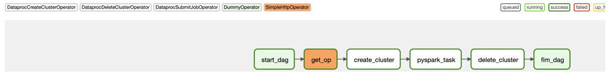
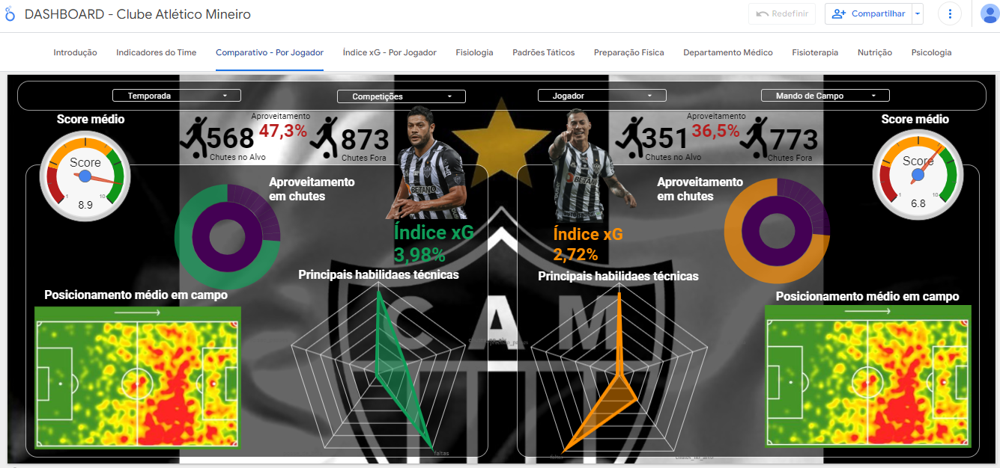

# Pipeline de dados - EXTRAÇÃO DE DADOS/SCOUTS PARA CRIAÇÃO DO DASHBOARD DO CLUBE ATLÉTICO MINEIRO 

O objetivo desse projeto foi criar um Dashboard com dados generalizados, integrando todos os departamentos do clube de futebol profissional para auxilio a área analytics, analistas de desempenho e comissão técnica do Clube atlético Mineiro.  

- **Fonte de Dados:** 
- SofaScore: https://www.sofascore.com/
- WhoScored: https://1xbet.whoscored.com/
- FBRef: https://fbref.com/pt/
- InfoGol: https://www.infogol.net/pt-br
- Footstats: http://www.footstats.com.br/#/

Para este projeto, foram usados as seguintes tecnologias: 

- **Airflow**: Para realizar a tarefa de orquestrar o pipeline;
- **Google Cloud Storage:** Para armazenamento de dados Brutos e Curados;
- **Big Query:** Para armazenamento de dados curados;
- **DataStudio:** Para criação do Dashboard;
- **Google Cloud Dataproc:** Para processamento de dados com Spark;
- **Google Cloud Run:** Para hospedar a API que realize a coleta dos dados na internet;

Os componentes foram organizados na seguinte arquitetura: 

Para o Airflow, foi utilizada uma imagem docker que está no diretório /airflow. Entretanto, para  subir o serviço localmente basta executar o comando **make** a partir do diretório raiz. 

A imagem abaixo ilustra a DAG criada para a orquestração. Existem dois operadores Dummy no inicio e fim para fins de organização. A task get_op é a responsável por realizar a chamada da API presente no Cloud Run e assim extrair os dados da fonte. Em seguida, a task create_cluster cria um cluster dataproc para realizar o processamento dos dados com Spark. A próxima task roda o job de processamento dentro do cluster recém criado e por último é feita a remoção do cluster.

A API foi feita utilizando o framework FastAPI e está presente no diretório /api. Para realizar o deploy dessa aplicação no Cloud Run basta executar o shell script presente na mesma pasta. Para que o deploy seja de fato realizado, é preciso estar logado em sua conta na Google Cloud Platform através da SDK. Caso ainda não tenha instalado, basta acessar esse [link](https://cloud.google.com/sdk/docs/install-sdk).

O pipeline em PySpark seguiu os seguintes passos: 

A função main recebe como parâmetro:
- path_input: Caminho dos dados no GCS gerados pela API coletora. Ex: gs://bucket_name/file_name.
- path_output: Caminho de onde será salvo os dados processados. Ex: gs://bucket_name_2/file_name.
- formato_file_save: Formato de arquivo a ser salvo no path_output. Ex: PARQUET.
- dataset: Dataset no BigQuery onde está a tabela.
- tabela_bq: Tabela do BigQuery que será salvo os dados. Ex: dataset.tabela_exemplo

Por último, e após a s tranformações nos dados, foi desenvolvido um dashboard usando a ferramenta Data Studio, da GCP. Abaixo está o link do relatório bem como o link para acesso (Nessa parte do projeto peço desculpas pois a tempos deixei o oficio de data viz a 4 anos atrás pra me dedicar a ENGENHARIA DE DADOS, e estou meio enferrujado....kkkk! Mas estou em busca de melhora 🙃 ). 

[Link](https://datastudio.google.com/reporting/acc2d3e0-8b83-44c7-af12-0dc7866b6faa/page/p_pe2dlvrh0c) para o dashboard.

