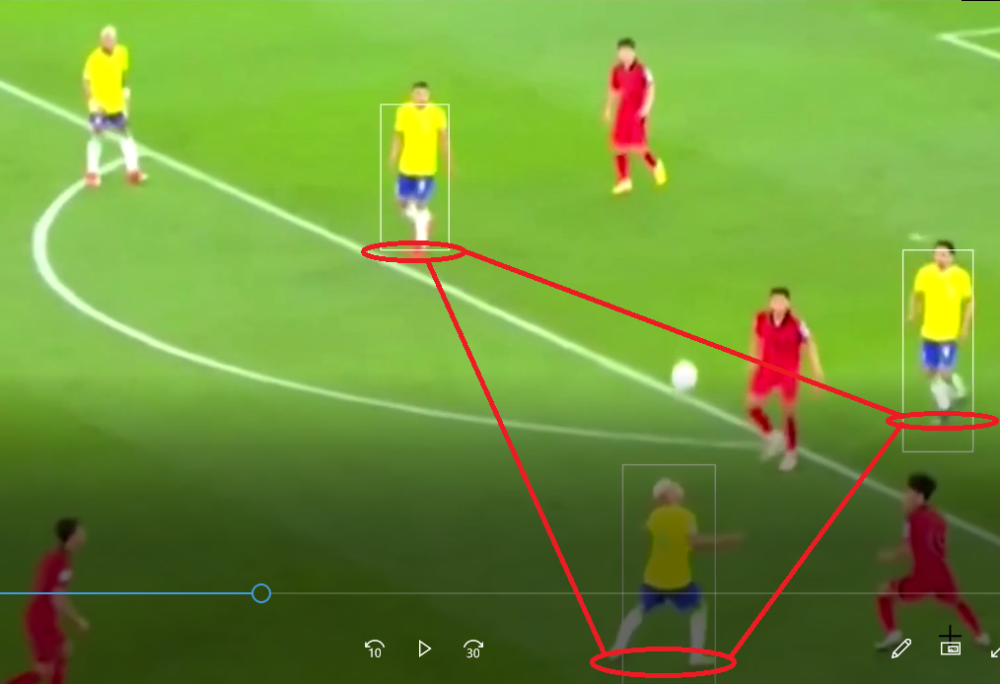

# Pipeline de dados - EXTRAÇÃO DE DADOS/SCOUTS PARA CRIAÇÃO DO DASHBOARD DO CLUBE ATLÉTICO MINEIRO 

O objetivo desse projeto é mostrar, por meio da biblioteca de manipulação de videos OPENCV a quantidade de insights que podem ser extraídos, auxiliando por exemplo um analist de desempenho dentro dos clubes. No video de apresentação da solução proposta, foi utilizado um video da construção da jogada que originou o 3° gol do Brasil contra a coreia do Sul, oitavas de final da copa de 2022.
Com essa biblioteca podemos analisar situações de linhas, jogadas ensaiadas, transições ofensivas, e uma infinidade de outras situações de jogo. 

